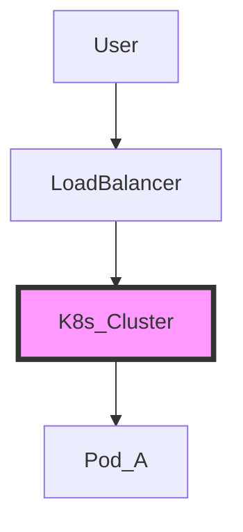

## 1. Testing Mermaid (Architecture)
If you see a flow chart below, the plugin is working.


```yaml
apiVersion: v1
kind: Pod
metadata:
  name: security-test
spec:
  containers:
  - name: sec-ctx-demo
    image: busybox
```
